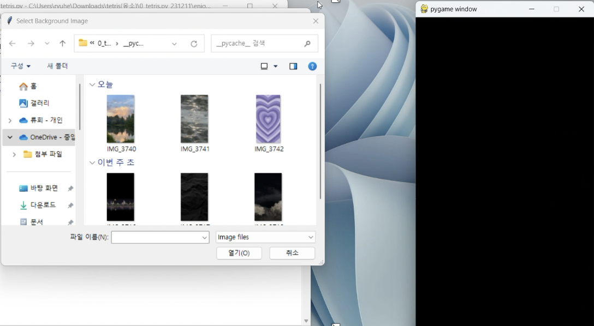
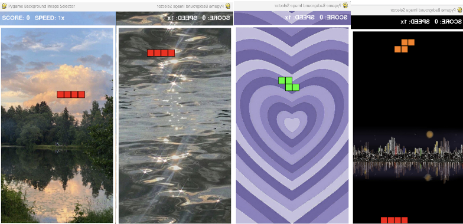
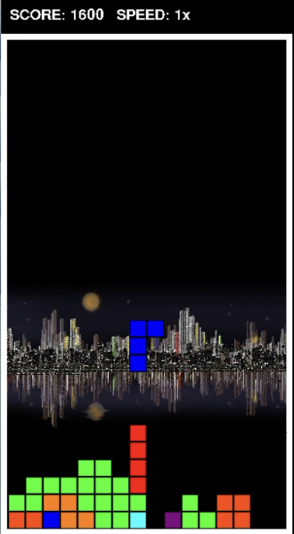

# ENJOY TETRIS!
 ---
 ## 🎮 게임 소개
 ### 이 프로젝트의 테트리스 게임에는 어떤 특징이 있는지 소개하는 내용(무슨 게임이고 전체적으로 어떤 기능이 있는지)을 맨 처음 부분에 적어두면 다른 사람들이 보고 이 프로젝트를 활용할지 말지 결정하기 쉽기 때문에 게임 소개에 관한 내용을 Readme 처음 부분에 포함하였다.
 ---
 - Enjoy Tetris 게임은 전통적인 테트리스 게임의 규칙을 따르며, 배경 음악이 함께 나와 게임을 더 재밌게 즐길 수 있는 테트리스 게임이다.
 - 사용자가 원하는 테트리스 배경색을 선택할 수 있다.
 - 플레이어는 떨어지는 블록을 조작하여 가로줄을 완성해 해당 줄이 사라지도록 해야 한다.
 - 시간이 지날수록 블록이 점점 빨리 내려오며, 높은 점수를 얻기 위해서는 빠른 반응과 전략이 필요하다.
 ---
 ## ✅ 프로젝트 실행 방법
 ### 이 게임은 pygame 이라는 프로그램이 이 프로젝트를 실행할 컴퓨터에 설치되어 있지 않으면 게임 실행이 되지 않기 때문에 이 게임을 실행하려면 아래의 코드로 pygame을 먼저 설치해야한다. 그래서 그 가이드에 대한 내용을 Readme에 포함하였다.
 ---
 - 이 게임은 pygame 라이브러리 기반이다. pip 도구를 이용하여 설치할 수 있다.
 - <pip3 install --user pygame>
 ---
 ## 📄 게임 설명서
 ### 이 게임을 하기 위해서는 기본적인 조작법과 규칙을 알아야 게임을 하는 사람도, 이 프로젝트를 활용하는 사람도 이해하기 쉽다. 또한 레벨과 점수에 관하여 어떤 기능이 있는지도 설명되어 있어야 코드를 분석할 때 도움이 되기 때문에 게임에 대한 설명서 내용을 포함하였다.
 ---
 <조작법>
 - <-/-> : 블록을 왼쪽, 오른쪽으로 이동(Left/Right)
 - space바 : 시계 방향으로 블록 회전(Rotate)
 - ↓ : 블록을 아래로 한 칸 이동(Down)
 - P or p키 : 게임 일시정지하기
 - Q or q키 : 게임 종료하기
 <레벨>
 - 레벨이 오를수록 블록이 떨어지는 속도가 증가한다.
 <점수>
 - 가로줄을 없앨수록 점수를 계속 얻게 되고, 점수에 따라 레벨로 올라간다.
 - 여러 줄을 한 번에 없애면 combo배로 더 많은 점수를 획득한다.
 - 블록이 없어지지 않고 다 차서 줄에 걸리게 되면 Game Over!
 ---
 ## 📸 게임 스크린샷(코드를 다 작성한 후에 스크린샷을 찍어 추후에 업로드 예정.)
 ### 게임의 시작화면, 게임 화면, 게임 플레이 화면, 종료된 화면을 차례대로 이미지로 보여줌으로써 이 프로젝트의 전체적인 작동과정과 기능을 시각적으로 한눈에 쉽게 볼 수 있기 때문에 게임 스크린샷 이미지 부분을 Readme 내용에 포함하였다.
 ---
 - ⏩️ 시작 화면

    
   
 - ⏩️ 게임 화면

     
 - ⏩️ 게임 플레이 화면
    

 ---

